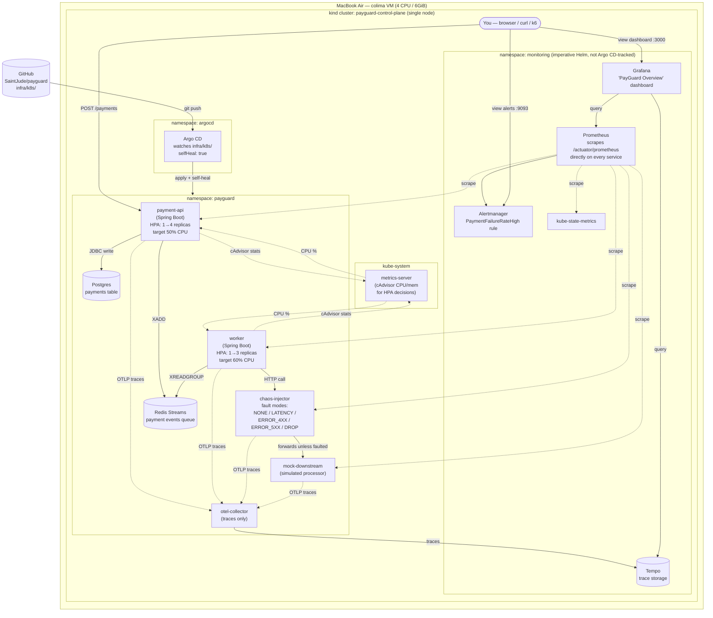

# PayGuard — System Architecture (Phase 7)

A current-state diagram of the whole system as of Phase 7 (Chaos,
Observability, Autoscaling). Unlike the per-phase `PHASE_N_DESIGN.md` docs
(which capture a single phase's *decision* and its alternatives/tradeoffs),
this is a single cross-phase picture of what's actually running today. See
`docs/demos/PHASE_7_DEMO.md` for how to go see each part of this live.

## Host boundary

Everything below runs inside **one `kind` node container**, itself inside
**colima's 4 CPU / 6GiB VM** on a single laptop — not a real multi-node
cluster. That shared, fixed budget is why the app workload and the
observability stack compete for the same headroom under load (see
`docs/phase-notes/PHASE_7_NOTES.md` and the Grafana/Prometheus resource
limits in `infra/observability/kube-prometheus-stack-values.yaml`).

## The two independent control loops

Easy to conflate — worth keeping separate in your head:

1. **GitOps loop (deploy-time):** you edit `infra/k8s/*.yaml` → commit → push
   → Argo CD notices the git diff → applies it to the cluster.
   `selfHeal: true` means Argo CD also *reverts* any live `kubectl edit`
   that doesn't match git — the manifests in git are the only durable way
   to change `payguard`'s resources.
2. **Autoscaling loop (run-time):** `metrics-server` polls each pod's real
   CPU usage from the kubelet's cAdvisor stats every few seconds → the HPA
   compares that to the pod's CPU *request* → adds/removes replicas. This
   loop runs continuously and has nothing to do with git; lowering a
   deployment's CPU request (a GitOps change) just makes this loop more
   sensitive.

## What's *not* on this diagram

- `docker-compose.yml` — a separate, simpler way to run `payment-api` +
  `worker` + Postgres + Redis with no Kubernetes at all (see README
  "Running it"). Not used once you're on the kind/Argo CD path.
- The `infra/helm/payguard/` chart — an alternative, untouched way to
  install the same `payguard` resources via Helm instead of raw manifests
  (Phase 5). Argo CD tracks the raw `infra/k8s/` manifests, not this chart.
- Node-exporter — explicitly disabled (Decision §10 of
  `PHASE_7_DESIGN.md`); every CPU/memory panel in Grafana reads cAdvisor
  via the kubelet instead, so a node-level DaemonSet was pure overhead here.
